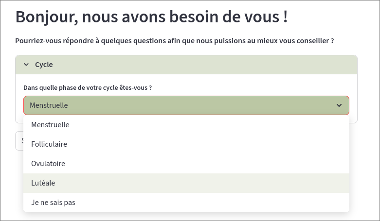
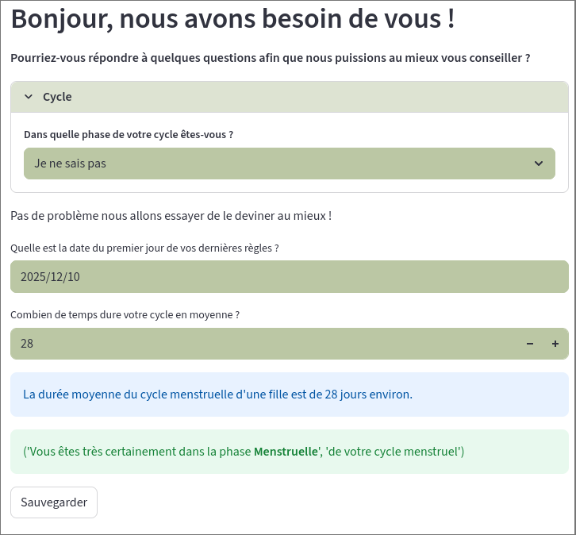
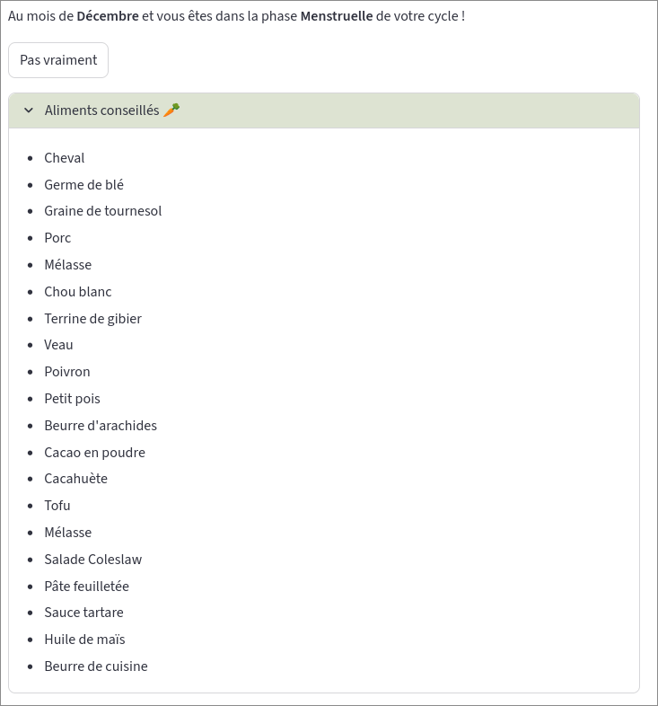
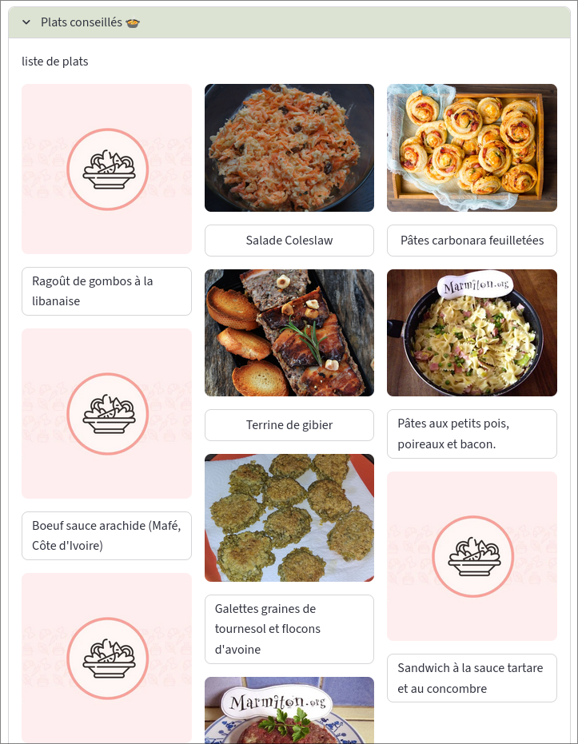

<h1 align="center">Cloud Project (frontend)</h1>

This is the frontend of the cloud project. 
The project is divided by two, as it is less a hustle to maintain as microservices.
More details about infrastructure is available on the [backend repo](https://github.com/Maskrpone/cloud-project-api)

## Links 
- [The actual web app](https://cloud-streamlit-container.victorioushill-fba44ff1.uksouth.azurecontainerapps.io)
- [GitHub repo of the API](https://github.com/Maskrpone/cloud-project-api)
- [Public API URL](https://cloud-project-api-container.victorioushill-fba44ff1.uksouth.azurecontainerapps.io)

### Context

A lot of women struggle with nutrition during their menstrual cycle.
Depending on the phase of this cycle, their body's needs variate a lot.
This is why we had the idea to make a tool that would prove actually useful for selfcare.
This tool is able to determine in which phase of the cycle a woman is and, based on that, 
proposes some nutrients that would help with struggles linked to this specific phase (e.g : high iron levels during the period phase to compensate the blood).
Because of its extensive database, it can proposes different foods for the same phase, making it easy to find something likeable. 
This tool is also able to recommand some recipes based on Marmiton.

### Disclaimer
This tool is by no mean a medical device, and can't replace some medical advices given by a professional healthcare.
The recipes might need to be double checked.

### Built with
The app was built using [Streamlit](https://streamlit.io/)
The streamlit app runs as a containerized project on Azure, using Azure Container Apps.
The entire infrastructure was delcared as code using Terraform (more on that [here](https://github.com/Maskrpone/cloud-project-api/tree/main/infra))

> [!NOTE]
> The github repositories was also configured using terraform (under `github-config/` folders), making it easy to explore.

Regarding the deployment, it is the very same process as for the API, except for the name of the container, which would be `cloud-streamlit` instead of `api-container`.

### Preview

